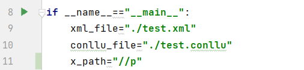

# Manuel d'utilisation de l'annotation 

## Description:
Cet API est principalement utilisé pour convertir un fichier XML en format CoNLL-U qui ne contient qu'une séries de tokens numétotés en effectuant la fonction de tokénisation ***'Tokenisation.py'***. Et puis cet API réalise une séries de fonctions, ***'Lemmatisation.py'***, ***'Posparse.py'***, ***'Featsparse.py'***, ***'Depparse.py'***, ***'Headparse.py'*** pour le traitement de la langue, tels que la segmentation des mots, la lemmatisation et l'étiquetage morphosyntaxique etc, et les écrit dans un même ficher CoNLL-U. ***'main.py'*** est responsable d'appeler les modules qu'on a mentionné au-dessus afin de réaliser le traitement de la langue.

## Utilisation

Après le clonage des scripts sur GitHub, il faut tout d'abord télécharger toutes les dépendances décrites dans le fichier **‘requrements.txt’** en faisant la demande **‘pip install -r requirements.txt’**.

Ensuite, dans le ficher ***'main.py'***, on exécute d'abord la fonction **'tokenize_xml'** de la classe **‘Tokenisation’**. Pour l'exécuter, il faut saisir le chemin d'accès du fichier XML, la formule XPATH qui indique la zone de texte à traiter et les processors. Une exception sera levée, si on ne trouve pas le ficher, le ficher n'est pas au format XML, ou les processors ne sont pas dans le même format que les descriptions, à savoir:

processors={

        "language":"fr",
        "tokenize" : {
                "tool":"nltk",
                "model":"tokenizers/punkt/french.pickle"
        },
        "pos": {
                "tool":"stanza",
                "model":"standard"
        },
        "feats": {
            "tool": "udpipe",
            "model": "fr"
        },
        "lemma": {
                "tool":"stanza",
                "model":"standard",
        },
        "headparse": {
            "tool": "spacy",
            "model": "fr_core_news_sm"
        },
        "depparse": {
                "tool":"spacy",
                "model":"fr_core_news_sm"
        }
        
    }
   
Il est à noter que l'utilisateur peut modifier la ***'language'***, le ***'tool'***, et le ***'model'*** correspondant, pour le ***'tool'***, il y a "stanza", "udpipe" et "spacy" au choix ( "nltk" en plus pour la tokenisation ), pour le ***'model'***, ce n'est pas fixé, on peut utiliser toutes les modèles de langage correspondants au ***'tool'***, mais il faut vérifier la bonne installation de ces modèles. Par défaut, on utilisera les ***'processors'*** mentionnés ci-dessus.

Avant l'utilisation, il faut aussi modifier le xml_file, conllu_file et x_path.

Puis on appèle les autres classes, ***'Lemmatisation'***, ***'Posparse'***, ***'Featsparse'***, ***'Depparse'***, ***'Headparse'***. 

Il faut noter que les fichier CoNLL-U d'entrée pour ces classes est le même ficher CoNLL-U alors que le  format de processors est le même que celui mentionné ci-dessus.

## API

* **Tokenisation.py**
  * Desciption: Ce code permet de transformer des fichiers XML en fichiers au format CoNLL-U qui ne contient qu'une série de tokens numérotés en utilisant différents outils tels que stanza、spacy、udpipe et nltk pour réaliser la tokénisation de mots.
  * Entrée :
    * input_file: le chemin d'accès du fichier XML 
    * xpath_expression:  l'expression XPath utilisée pour sélectionner la zone de texte à traiter
    * processors:  un dictionnaire contenant des informations sur la langue et les outils de traitement
    * output_file: le chemin d'accès du fichier CoNLL-U
  * Return :
    * output_file: le fichier CoNLL-U

* **Lemmatisation.py**
  * Desciption: Ce code définit une classe ‘Lemmatisation’ avec une méthode ‘lemma_wrapper’ qui lemmatise un fichier CoNLL-U en utilisant différentes outils (Stanza, spaCy et UDPipe) 
  * Entrée :
    * conllu_filename: le chemin d'accès du fichier CoNLL-U
    * processors : un dictionnaire contenant des informations sur la langue et les outils de traitement
  * Return :
    * output_file: le fichier CoNLL-U
* **Posparse.py**
  * Desciption: Ce code définit une classe ‘Featsparse’ avec une méthode ‘pos_wrapper’ qui réalise un étiquetage de parties du discours (POS) en utilisant différentes outils (Stanza, spaCy et UDPipe) 
  * Entrée :
    * conllu_filename: le chemin d'accès du fichier CoNLL-U
    * processors : un dictionnaire contenant des informations sur la langue, l'outil et le modèle à utiliser pour réaliser l'étiquetage de parties du discours (POS)
  * Return :
    * output_file: le fichier CoNLL-U

* **Featsparse.py**
  * Desciption: Ce code définit une classe ‘Featsparse’ avec une méthode ‘feats_wrapper’ qui permet de calculer les caractéristiques pour chaque jeton en utilisant différentes outils (Stanza, spaCy et UDPipe) 
  * Entrée :
    * conllu_filename: le chemin d'accès du fichier CoNLL-U
    * processors : un dictionnaire contenant des informations sur la langue, l'outil et le modèle à utiliser pour calculer les caractéristiques pour chaque jeton
  * Return :
    * output_file: le fichier CoNLL-U

* **Depparse.py**
  * Desciption: Ce code définit une classe ‘Depparse’ avec une méthode ‘deprel_wrapper’ qui réalise l'analyse des dépendances en utilisant différentes outils (Stanza, spaCy et UDPipe).
  * Entrée :
    * conllu_filename: le chemin d'accès du fichier CoNLL-U
    * processors : un dictionnaire contenant des informations sur la langue,l'outil et le modèle à utiliser pour l'analyse des dépendances
  * Return :
    * output_file: le fichier CoNLL-U

* **Headparse.py**
  * Desciption: Ce code définit une classe ‘Headparse’ avec une méthode ‘head_wrapper’ qui permet de réaliser l'analyse de la tête de chaque jeton en utilisant différentes outils (Stanza, spaCy et UDPipe).
  * Entrée :
    * conllu_filename: le chemin d'accès du fichier CoNLL-U
    * processors : un dictionnaire contenant des informations sur la langue,l'outil et le modèle à utiliser pour l'analyse de la tête de chaque jeton 
  * Return :
    * output_file: le fichier CoNLL-U

* **main.py**
  * Ce code permet de faire appel aux différentes classes pour le traitement de la langue, tels que la segmentation des mots, la lemmatisation et l'étiquetage morphosyntaxique etc.

* **informations supplémentaires**
  * En ce qui concerne l'utilisation des outils de traitement des langues, nous avons aussi essayé HOPS, mais nous avons trouvé un bug ci-dessous lorque nous voulions charger le modèle de langage :

    """
    pydantic.error_wrappers.ValidationError: 1 validation error for BiAffineParserConfig
    multitask_loss
      field required (type=value_error.missing)
    """
  
    Nous avons cherché donc sur Internet et trouvé la réponse de la part du créateur de ce module, et c'est un problème lié à la mise à nouveau de version de 0.6.0 à 0.7.0. Donc, nous n'arrivons pas à utiliser HOPS malheureusement.

## Les fichers
  * **Tokenisation.py**
    * Tokéniser les fichiers XML, et les écrire dans le ficher CoNLL-U.
  * **Lemmatisation.py**
    * Lémmatiser les tokens du ficher CoNLL-U, et ajouter les lemmas dans ce ficher.
  * **Posparse.py**
    * Réaliser l'étiquetage de parties du discours et l'ajouter dans ce ficher.
  * **Featsparse.py**
    * Calculer les caractéristiques pour chaque jeton et l'ajouter dans ce ficher.
  * **Depparse.py**
    * Réaliser l'analyse des dépendances et l'ajouter dans ce ficher.
  * **Headparse.py**
    * Réaliser l'analyse de la tête de chaque jeton et l'ajouter dans ce ficher.
  * **main.py**
    * Il est résponsable de réaliser l'annotation en appelant toutes les classes.
  * **test.xml**
    * Ce ficher xml est utilisé pour un petit test.
  * **test.conllu**
    * Le résultat de test.
  * **requirements.txt**
    * Les dépendances de ce projet, l'utilisateur doit les télécharger avant d'utiliser les scripts.

## Améliorations possibles

* Pour faciliter la construction de ***'processors'***, on peut faire une liste de ***'tool'*** et ***'model'*** correspondant disponible, potentiellement, une guide de l'installation des modèles de langage peut aussi être utile.
* Dans ce projet, on fait tous les traitements, tels que la lemmatisation, le posparse en même temps. Mais après, on peut laisser aux utilisateurs à choisir les traitements nécessaires.